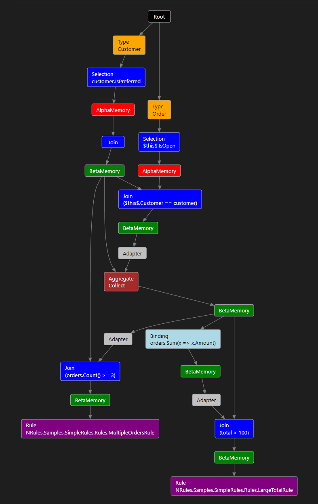
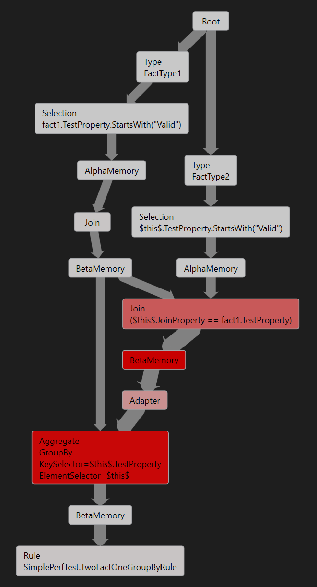
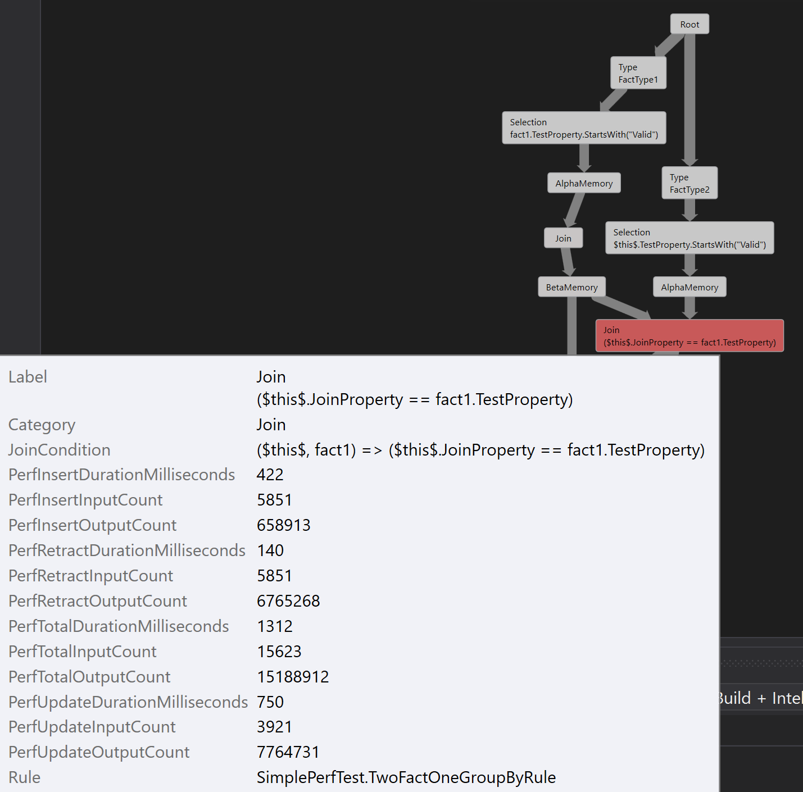

# Diagnostics

NRules has several facilities to monitor execution and troubleshoot issues with the rules.

There is an event model where one can hook into the engine at various points of the execution cycle. 
NRules does not directly integrate with any of the .NET logging frameworks, so use these events to hook up the logging framework that your application is using.

Metrics provider exposes granular performance information at the level of the underlying Rete graph, which can help with the rules performance profiling.
The performance metrics can also be attributed to the individual parts of the rules, by tying those metrics to the structural elements of the Rete network graph and the rule’s AST.

There is also a Visual Studio debugger visualizer that can render a rules session as a graph representation of the underlying Rete network, which can greatly assist in understanding of what goes on in the rules engine behind the scenes in a concrete scenario.

## Execution Event Model
Rules engine lifecycle events for a given rules session are exposed via an [IEventProvider](xref:NRules.Diagnostics.IEventProvider) accessible through the [Events](xref:NRules.ISession.Events) property on the [ISession](xref:NRules.ISession) interface.
Also, events for all sessions are exposed via the [IEventProvider](xref:NRules.Diagnostics.IEventProvider) accessible through the [ISessionFactory](xref:NRules.ISessionFactory) interface (sender object for each event references the actual session object that raised the event).

Event provider exposes the following execution events:

Category | Event | Description
--- | --- | ---
Working Memory Events | FactInsertingEvent | Raised when a fact is getting inserted into the session, before it propagates through the Rete network.
Working Memory Events | FactInsertedEvent | Raised when a fact is getting inserted into the session, after it propagates through the Rete network.
Working Memory Events | FactUpdatingEvent | Raised when a fact is getting updated in the session, before it propagates through the Rete network.
Working Memory Events | FactUpdatedEvent | Raised when a fact is getting updated in the session, before it propagates through the Rete network.
Working Memory Events | FactRetractingEvent | Raised when a fact is getting retracted from the session, before it propagates through the Rete network.
Working Memory Events | FactRetractedEvent | Raised when a fact is getting retracted from the session, before it propagates through the Rete network.
Agenda Events | ActivationCreatedEvent | Raised when a rule matches a full set of facts, creating a new activation.
Agenda Events | ActivationUpdatedEvent | Raised when some facts in a rule match are updated, causing an update of the activation.
Agenda Events | ActivationDeletedEvent | Raised when a rule match gets invalidated, causing a deletion of the activation.
Agenda Events | RuleFiringEvent | Raised when a rule activation is selected as the next to fire, before the rule actions are executed.
Agenda Events | RuleFiredEvent | Raised when a rule has fired on an activation, after the actions are executed.
Error Handling Events | LhsExpressionFailedEvent | Raised when an exception is thrown during the evaluation of a left-hand side expression (i.e. a rule's condition, binding expression or aggregation expression).
Error Handling Events | AgendaExpressionFailedEvent | Raised when an exception is thrown during the evaluation of an agenda expression (i.e. a rule's filter expression).
Error Handling Events | RhsExpressionFailedEvent | Raised when an exception is thrown during the evaluation of a right-hand side expression (i.e. a rule's action).
Expression Trace Events | LhsExpressionEvaluatedEvent | Raised after a left-hand side expression is evaluated (i.e. a rule's condition, binding expression or aggregation expression).<br/>:warning: Using this event handler may affect engine's performance.
Expression Trace Events | AgendaExpressionEvaluatedEvent | Raised after an agenda expression is evaluated (i.e. a rule's filter expression).<br/>:warning: Using this event handler may affect engine's performance.
Expression Trace Events | RhsExpressionEvaluatedEvent | Raised after a right-hand side expression is evaluated (i.e. a rule's action).<br/>:warning: Using this event handler may affect engine's performance.

```c#
ISession session = factory.CreateSession();
session.Events.RuleFiringEvent += OnRuleFiringEvent;

//...

private static void OnRuleFiringEvent(object sender, AgendaEventArgs e)
{
    Console.WriteLine("Rule about to fire {0}", e.Rule.Name);
}
```

## Performance Metrics
In NRules, rules are compiled into a Rete network for efficient fact matching. As the rules session is going through the execution cycles, it collects performance statistics for each node in the Rete graph. This information could be handy in rules performance profiling.
These metrics are used to feed the performance view in the debugger visualizer, but can also be queried programmatically via the [IMetricsProvider](xref:NRules.Diagnostics.IMetricsProvider) accessible through the [Metrics](xref:NRules.ISession.Metrics) property on the [ISession](xref:NRules.ISession) interface.
Metrics accessible via the metrics provider correspond to the nodes in the Rete graph, which represents the compiled rules. This Rete graph can be retrieved from the [ISession](xref:NRules.ISession) or [ISessionFactory](xref:NRules.ISessionFactory) using the [GetSchema()](xref:NRules.Diagnostics.ISessionSchemaProvider.GetSchema) method. Each node in the Rete graph contains the information such as the node type, contained expressions, etc., as well as an Id that corresponds to the node Id used by the metrics provider.

```c#
ReteGraph reteGraph = session.GetSchema();
ReteNode node = reteGraph.Nodes.First(n => n.NodeType == NodeType.BetaMemory);
INodeMetrics nodeMetrics = session.Metrics.FindByNodeId(node.Id);
long totalTimeSpentMsec = nodeMetrics.InsertDurationMilliseconds +
                          nodeMetrics.UpdateDurationMilliseconds +
                          nodeMetrics.RetractDurationMilliseconds;
Console.WriteLine($"Node {node.Id}:{node.NodeType}. ElementCount={nodeMetrics.ElementCount}, TotalTimeSpentMsec={totalTimeSpentMsec}");
``` 

There are two types of node metrics: those that reflect the current state of the node (e.g. [ElementCount](xref:NRules.Diagnostics.INodeMetrics.ElementCount) that corresponds to the number of elements present in a memory node), and cumulative metrics that are accumulated as facts pass through the nodes. The cumulative metrics for a given node or the whole session can be reset to zero using the [Reset()](xref:NRules.Diagnostics.IMetricsProvider.Reset) method.

```c#
session.Metrics.Reset();
``` 

## Debugger Visualizer
Debugger visualiser is an add-on component for Visual Studio that adds visualization capabilities for certain .NET types.
Debugger visualizer that comes with NRules adds such visualization capability for [ISession](xref:NRules.ISession) and [ISessionFactory](xref:NRules.ISessionFactory) types. It also requires a '[DGML](http://en.wikipedia.org/wiki/DGML) editor' feature, which must be enabled when installing Visual Studio.

NRules debugger visualiser is supported for Visual Studio 2022.

NRules debugger visualizer is not packaged, so you need to clone NRules git repository from GitHub and build it yourself. Make sure to clone exactly the same version of the repo as the version of NRules library you are using in your project.
To build NRules debugger visualizer, first build NRules:

```console
build.bat
```

Then build the visualizer:
```console
build.bat Build Visualizer
```

After building, get the contents of `<Repo Root>\binaries\NRules.Debugger.Visualizer` folder and copy to `<Documents>\Visual Studio <Version>\Visualizers`.

If installed correctly, any time you debug a program that uses NRules, a magnifying glass icon will appear next to the instances of [ISession](xref:NRules.ISession) and [ISessionFactory](xref:NRules.ISessionFactory) in the watch window.
Click on the magnifying glass to open a graphical view of that instance of the rules session.

Both [ISession](xref:NRules.ISession) and [ISessionFactory](xref:NRules.ISessionFactory) can produce a visualization for the Rete graph that corresponds to the compiled rules.



In addition to that, [ISession](xref:NRules.ISession) has an option of generating a visualization for the Rete graph with the embedded performance metrics and styling that helps pinpoint performance bottlenecks.
To use it, select a drop-down list next to the magnifying glass, when hovering over the [ISession](xref:NRules.ISession) instance, and click 'NRules Session Performance Visualizer'.
The rete graph in this mode has peformance metrics attached to the graph nodes, and the graph style reflects them. The thickness of edges reflects the volume of facts flowing through them; the color of nodes reflects the amount of time spent in that node; and the size of memory nodes reflects the number of objects stored in them.



Performance properties associated with each node, including the detailed fact counts, timing information and the rules the node belongs to, can be viewed in node tooltips, or in the properties window.


